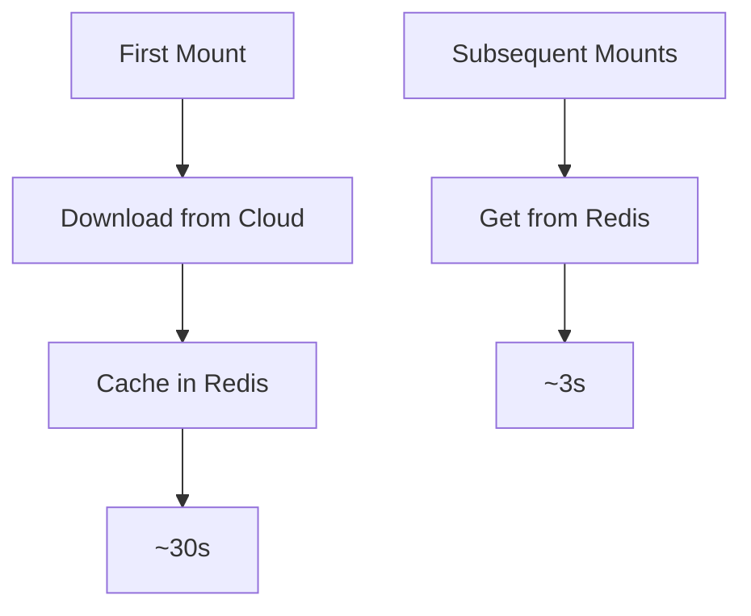

# Redis Cache Layer for BrowserState

## Overview
The Redis cache layer is an optional feature that provides fast access to frequently used browser sessions by caching them in Redis. This is particularly useful when using cloud storage providers (GCS, S3) to improve mount/unmount performance.

## Features
- Fast access to frequently used sessions
- Automatic cache invalidation
- Configurable TTL (Time To Live)
- Multiple cache eviction strategies (LRU, FIFO)
- Support for all cloud storage providers
- Path validation for cached data
- Optional background synchronization

## Configuration

### Basic Setup
```typescript
const browserState = new BrowserState({
  userId: 'user123',
  storageType: 'gcs', // or 's3'
  redisOptions: {
    host: 'localhost',
    port: 6379,
    ttl: 172800,         // Cache for 48 hours (default)
    maxSize: 100,        // Maximum number of sessions to cache (default)
    cacheStrategy: 'lru' // Use LRU cache eviction strategy (default)
  }
});
```

### Redis Cache Options
```typescript
interface RedisCacheOptions {
  // Basic connection options
  host: string;
  port: number;
  password?: string;
  db?: number;
  tls?: boolean | { rejectUnauthorized: boolean };

  // Cache configuration
  keyPrefix?: string;    // Default: "browserstate:"
  ttl?: number;          // Time to live in seconds (default: 172800 - 48 hours)
  maxSize?: number;      // Maximum number of sessions to cache (default: 100)
  maxMemory?: string;    // Maximum memory usage (e.g., '2gb')

  // Advanced options
  compression?: boolean;           // Whether to compress data before caching
  cacheStrategy?: "lru" | "fifo";  // Cache eviction strategy (default: "lru")
  validateOnRead?: boolean;        // Whether to validate cached paths on read (default: true)
  backgroundSync?: boolean;        // Whether to sync in background (default: false)
}
```

## Usage

### Mounting with Cache
```typescript
// First mount - downloads from cloud and caches in Redis
const userDataDir = await browserState.mount('session123');

// Second mount - uses Redis cache if available
const userDataDir2 = await browserState.mount('session123');
```

### Cache Invalidation
The cache is automatically invalidated when:
- A session is deleted
- The cache TTL expires
- The cached path no longer exists (when validateOnRead is enabled)
- An error occurs during cache operations
- The maximum cache size is reached (oldest sessions are evicted)

## Performance Benefits

### Mount Times


### Resource Usage
- Reduced cloud storage operations
- Lower bandwidth consumption
- Faster session access
- Better scalability
- Configurable memory limits with maxSize and maxMemory options

## Implementation Details

### Cache Structure
Redis keys are structured as follows:
```
{keyPrefix}session:{sessionId} -> Session data
{keyPrefix}metadata:{sessionId} -> Metadata (timestamp, size, etc.)
{keyPrefix}access -> Sorted set for LRU tracking
```

### Key Features
1. **Automatic Fallback**
   - Tries Redis cache first
   - Falls back to cloud storage if cache miss
   - Updates cache on successful cloud operations

2. **Cache Eviction Strategies**
   - LRU (Least Recently Used) - default strategy
   - FIFO (First In, First Out) - alternative strategy
   - Automatic eviction when size exceeds maxSize

3. **Path Validation**
   - Optional verification of cached file paths (validateOnRead)
   - Automatic invalidation if paths don't exist
   - Maintains data consistency

4. **Error Handling**
   - Graceful degradation on Redis failures
   - Automatic cache invalidation on errors
   - Comprehensive error logging

## Best Practices

### Configuration
1. **TTL Settings**
   - Default is 48 hours (172800 seconds)
   - Adjust based on session usage frequency
   - Consider storage constraints and data freshness

2. **Redis Setup**
   - Use Redis cluster for high availability
   - Enable persistence if needed
   - Configure memory limits with maxMemory option
   - Set appropriate maxSize based on expected usage

3. **Cache Strategy**
   - Use LRU for most cases (default)
   - Use FIFO when session age is more important than usage frequency

### Usage
1. **Session Management**
   - Keep frequently used sessions in cache
   - Clean up unused sessions with deleteSession
   - Monitor cache size with listSessions

2. **Error Handling**
   - Implement proper error recovery
   - Monitor cache failures
   - Handle Redis connection issues

## Limitations
- Only works with cloud storage providers
- Requires Redis server
- Additional infrastructure needed
- Memory usage in Redis (configurable with maxSize and maxMemory)

## Future Improvements
1. **Delta Sync**
   - Implement incremental updates
   - Cache file metadata
   - Support partial syncs

2. **Advanced Features**
   - Compression support is prepared but not fully implemented
   - Background synchronization is prepared but not fully implemented
   - Cluster support for distributed environments

3. **Monitoring**
   - Cache statistics
   - Performance metrics
   - Health checks

## Example Implementation
See `typescript/src/storage/RedisCacheProvider.ts` for the complete implementation. 