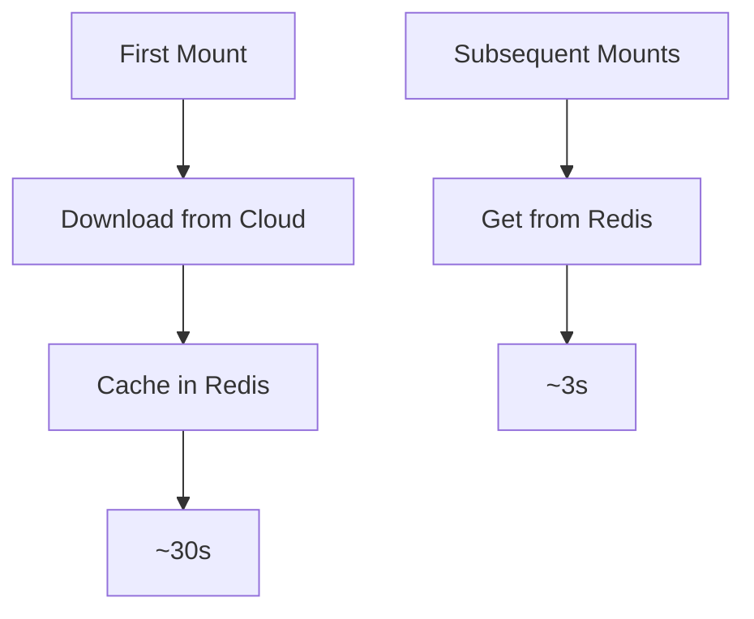

# Redis Cache Layer for BrowserState

## Overview
The Redis cache layer is an optional feature that provides fast access to frequently used browser sessions by caching them in Redis. This is particularly useful when using cloud storage providers (GCS, S3) to improve mount/unmount performance.

## Features
- Fast access to frequently used sessions
- Automatic cache invalidation
- Configurable TTL (Time To Live)
- Support for all cloud storage providers
- Prepared for future delta sync support

## Configuration

### Basic Setup
```typescript
const browserState = new BrowserState({
  userId: 'user123',
  storageType: 'gcs', // or 's3'
  redisOptions: {
    enabled: true,     // Enable Redis caching
    host: 'localhost',
    port: 6379,
    ttl: 3600         // Cache for 1 hour
  }
});
```

### Redis Options
```typescript
interface RedisOptions {
  enabled: boolean;    // Whether to enable Redis caching
  host: string;        // Redis host
  port: number;        // Redis port
  password?: string;   // Redis password (optional)
  db?: number;         // Redis database number (optional)
  tls?: boolean;       // Use TLS (optional)
  keyPrefix?: string;  // Key prefix for Redis keys
  ttl?: number;        // Time to live in seconds
}
```

## Usage

### Mounting with Cache
```typescript
// First mount - downloads from cloud and caches in Redis
const userDataDir = await browserState.mount('session123');

// Second mount - uses Redis cache if available
const userDataDir2 = await browserState.mount('session123');
```

### Cache Invalidation
The cache is automatically invalidated when:
- A session is deleted
- The cache TTL expires
- The cached path no longer exists
- An error occurs during cache operations

## Performance Benefits

### Mount Times


### Resource Usage
- Reduced cloud storage operations
- Lower bandwidth consumption
- Faster session access
- Better scalability

## Implementation Details

### Cache Structure
```
browserstate:{userId}:{sessionId} -> {userDataDir}
```

### Key Features
1. **Automatic Fallback**
   - Tries Redis cache first
   - Falls back to cloud storage if cache miss
   - Updates cache on successful cloud operations

2. **Error Handling**
   - Graceful degradation on Redis failures
   - Automatic cache invalidation on errors
   - Maintains data consistency

3. **Future Delta Sync Support**
   - Prepared for metadata caching
   - Ready for incremental updates
   - Supports version tracking

## Best Practices

### Configuration
1. **TTL Settings**
   - Set appropriate TTL based on usage patterns
   - Consider session frequency
   - Account for storage constraints

2. **Redis Setup**
   - Use Redis cluster for high availability
   - Enable persistence if needed
   - Configure memory limits

3. **Monitoring**
   - Track cache hit rates
   - Monitor Redis memory usage
   - Watch for cache invalidation patterns

### Usage
1. **Session Management**
   - Keep frequently used sessions in cache
   - Clean up unused sessions
   - Monitor cache size

2. **Error Handling**
   - Implement proper error recovery
   - Monitor cache failures
   - Handle Redis connection issues

## Limitations
- Only works with cloud storage providers
- Requires Redis server
- Additional infrastructure needed
- Memory usage in Redis

## Future Improvements
1. **Delta Sync**
   - Implement incremental updates
   - Cache file metadata
   - Support partial syncs

2. **Advanced Features**
   - Compression support
   - Cache warming
   - Distributed caching

3. **Monitoring**
   - Cache statistics
   - Performance metrics
   - Health checks

## Example Implementation
See `examples/redis-cache-example.ts` for a complete example demonstrating Redis caching with BrowserState. 