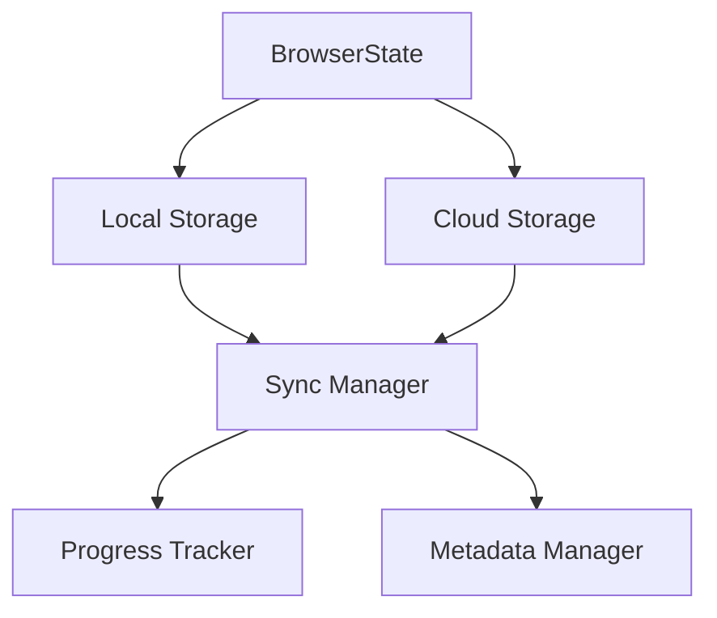

# BrowserState: Efficient Cloud Sync System Design
> Design document for the BrowserState cloud synchronization feature

## Overview

The BrowserState Sync system provides efficient synchronization of browser state between local storage and cloud storage providers. It uses a delta-based approach to minimize data transfer and optimize performance.

## Core Concepts

### 1. BrowserState
- Represents the complete state of a browser session
- Includes cookies, localStorage, sessionStorage, and other browser-specific data
- Organized by user and session IDs for multi-user support

### 2. Storage Providers
- Local Storage: Maintains browser state on the local filesystem
- Cloud Storage: Syncs browser state to remote storage (e.g., GCS, S3)
- Provider Interface: Standard interface for implementing new storage providers

### 3. Sync System
- Delta-based synchronization
- Metadata tracking for efficient updates
- Progress tracking and reporting
- Error handling and recovery

## Architecture



## Key Components

### 1. SyncManager
```typescript
interface SyncManager {
  // Core sync operations
  syncToCloud(): Promise<void>;
  syncFromCloud(): Promise<void>;
  
  // Metadata operations
  getMetadata(): Promise<Map<string, FileMetadata>>;
  saveMetadata(metadata: Map<string, FileMetadata>): Promise<void>;
  
  // Progress tracking
  onProgress(callback: (event: ProgressEvent) => void): void;
}
```

### 2. FileMetadata
```typescript
interface FileMetadata {
  path: string;          // Relative path within session
  hash: string;          // MD5 hash of file contents
  size: number;          // File size in bytes
  modTime: number;       // Last modification timestamp
}
```

### 3. Progress Tracking
```typescript
interface ProgressEvent {
  type: 'download' | 'upload';
  fileName: string;
  bytesTransferred: number;
  totalBytes: number;
  percentage: number;
}
```

## Sync Process

### 1. Initial Mount
1. Check if session exists in cloud storage
2. If exists:
   - Download metadata
   - Compare with local state
   - Download only changed files
3. If new:
   - Create new session
   - Initialize empty state

### 2. During Operation
1. Track file changes locally
2. Update metadata periodically
3. Report progress for large operations

### 3. Unmount/Sync
1. Calculate delta between local and cloud state
2. Upload only changed files
3. Update metadata
4. Report progress

## Configuration Options

```typescript
interface SyncOptions {
  // Metadata options
  storeMetadataOnProvider: boolean;    // Store metadata in cloud
  metadataUpdateInterval: number;      // Update interval in seconds
  
  // Performance options
  maxConcurrentOperations: number;     // Max concurrent file operations
  chunkSize: number;                   // Transfer chunk size
  
  // Retry options
  maxRetries: number;                  // Max retry attempts
  retryDelay: number;                  // Delay between retries
}
```

## Implementation Guidelines

### 1. Storage Provider Implementation
```typescript
interface CloudStorageProvider {
  // Core operations
  download(userId: string, sessionId: string): Promise<string>;
  upload(userId: string, sessionId: string, sourcePath: string): Promise<void>;
  
  // File operations
  downloadFile(cloudPath: string, localPath: string): Promise<boolean>;
  uploadFile(filePath: string, cloudPath: string): Promise<void>;
  deleteFile(cloudPath: string): Promise<void>;
  
  // Metadata operations
  getMetadata(userId: string, sessionId: string): Promise<Map<string, FileMetadata>>;
  saveMetadata(userId: string, sessionId: string, metadata: Map<string, FileMetadata>): Promise<void>;
}
```

### 2. Progress Tracking
- Implement progress events for all file operations
- Calculate and report transfer speeds
- Handle cancellation and cleanup

### 3. Error Handling
- Implement retry logic for transient failures
- Handle network interruptions gracefully
- Maintain consistency during failures

## Best Practices

### 1. Performance
- Use streaming for large file transfers
- Implement concurrent operations where possible
- Cache metadata locally
- Use efficient diff algorithms

### 2. Reliability
- Implement atomic operations
- Use checksums for data integrity
- Handle partial failures gracefully
- Maintain operation logs

### 3. Security
- Encrypt sensitive data
- Use secure authentication
- Implement access control
- Validate file integrity

## Example Implementation

### TypeScript Implementation
```typescript
// Initialize BrowserState with sync
const browserState = new BrowserState({
  userId: 'user123',
  storageType: 'gcs',
  useSync: true,
  syncOptions: {
    storeMetadataOnProvider: true,
    metadataUpdateInterval: 60,
    maxConcurrentOperations: 5,
    chunkSize: 1024 * 1024, // 1MB
    maxRetries: 3,
    retryDelay: 1000
  }
});

// Mount session with sync
const userDataDir = await browserState.mount('session456');

// Use browser
const browser = await chromium.launchPersistentContext(userDataDir);
const page = await browser.newPage();

// Changes are automatically tracked and synced
await page.goto('https://example.com');

// Unmount triggers sync
await browserState.unmount();
```

### Python System Design
```python
from abc import ABC, abstractmethod
from dataclasses import dataclass
from typing import Dict, Optional, Protocol
from datetime import datetime
import asyncio
from enum import Enum

class SyncType(Enum):
    DOWNLOAD = "download"
    UPLOAD = "upload"

@dataclass
class FileMetadata:
    path: str
    hash: str
    size: int
    mod_time: datetime

@dataclass
class ProgressEvent:
    type: SyncType
    file_name: str
    bytes_transferred: int
    total_bytes: int
    percentage: float

class ProgressCallback(Protocol):
    async def __call__(self, event: ProgressEvent) -> None: ...

class CloudStorageProvider(ABC):
    @abstractmethod
    async def download(self, user_id: str, session_id: str) -> str:
        """Download session from cloud storage"""
        pass

    @abstractmethod
    async def upload(self, user_id: str, session_id: str, source_path: str) -> None:
        """Upload session to cloud storage"""
        pass

    @abstractmethod
    async def get_metadata(self, user_id: str, session_id: str) -> Dict[str, FileMetadata]:
        """Get metadata for session"""
        pass

    @abstractmethod
    async def save_metadata(self, user_id: str, session_id: str, metadata: Dict[str, FileMetadata]) -> None:
        """Save metadata for session"""
        pass

class SyncManager:
    def __init__(
        self,
        storage_provider: CloudStorageProvider,
        progress_callback: Optional[ProgressCallback] = None
    ):
        self.storage_provider = storage_provider
        self.progress_callback = progress_callback
        self._metadata: Dict[str, FileMetadata] = {}

    async def sync_to_cloud(self, user_id: str, session_id: str, source_path: str) -> None:
        """Sync local changes to cloud storage"""
        pass

    async def sync_from_cloud(self, user_id: str, session_id: str) -> str:
        """Sync cloud changes to local storage"""
        pass

    async def _update_progress(self, event: ProgressEvent) -> None:
        """Update progress through callback"""
        if self.progress_callback:
            await self.progress_callback(event)

class BrowserState:
    def __init__(
        self,
        user_id: str,
        storage_type: str,
        use_sync: bool = False,
        sync_options: Optional[Dict] = None
    ):
        self.user_id = user_id
        self.storage_type = storage_type
        self.use_sync = use_sync
        self.sync_options = sync_options or {}
        self.sync_manager: Optional[SyncManager] = None

    async def mount(self, session_id: str) -> str:
        """Mount a browser session with optional sync"""
        pass

    async def unmount(self) -> None:
        """Unmount session and sync changes if enabled"""
        pass

# Example usage
async def main():
    browser_state = BrowserState(
        user_id="user123",
        storage_type="gcs",
        use_sync=True,
        sync_options={
            "store_metadata_on_provider": True,
            "metadata_update_interval": 60,
            "max_concurrent_operations": 5,
            "chunk_size": 1024 * 1024,  # 1MB
            "max_retries": 3,
            "retry_delay": 1.0
        }
    )

    async def progress_handler(event: ProgressEvent):
        print(f"{event.type.value}: {event.file_name} - {event.percentage:.1f}%")

    user_data_dir = await browser_state.mount("session456")
    # Use browser...
    await browser_state.unmount()

if __name__ == "__main__":
    asyncio.run(main())

## Testing

### 1. Unit Tests
- Test individual components
- Mock storage providers
- Verify metadata handling
- Test error scenarios

### 2. Integration Tests
- Test with real storage providers
- Verify sync operations
- Test concurrent operations
- Verify data consistency

### 3. Performance Tests
- Measure sync times
- Test with large datasets
- Verify memory usage
- Test network conditions

## Future Improvements

1. **Compression**
   - Implement file compression
   - Support different compression algorithms
   - Configurable compression levels

2. **Deduplication**
   - Implement file deduplication
   - Use content-based addressing
   - Optimize storage usage

3. **Conflict Resolution**
   - Implement conflict detection
   - Support merge strategies
   - Version control integration

4. **Advanced Features**
   - Support for partial sync
   - Background sync
   - Offline support
   - Real-time sync

## Contributing

1. Follow the established patterns
2. Implement comprehensive tests
3. Document new features
4. Update examples
5. Follow security guidelines

## License

This design document is part of the BrowserState project and follows its licensing terms. 